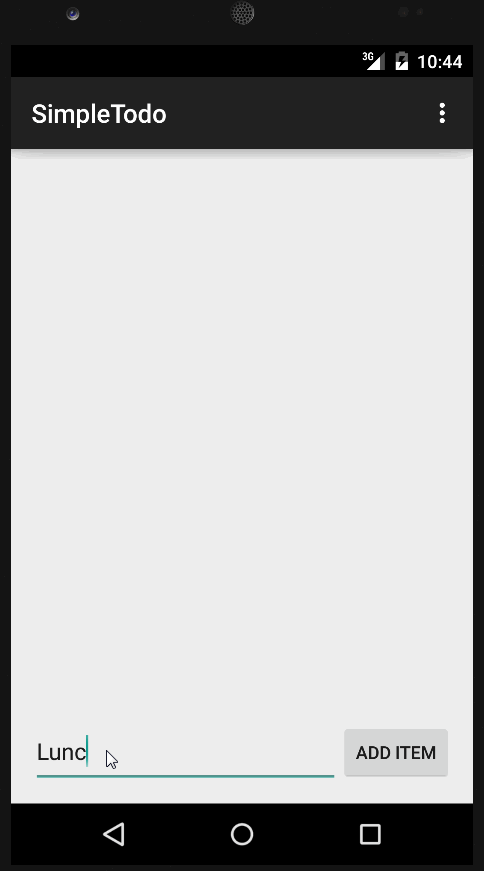

# SimpleTodo
CodePath Android Prework - Todo App

Time Spent: 7 hours total (3 hrs for setup to the basic version, addtional 4 to get to this version)

Basic Functionalities:
- Successfully add and remove items from the todo list within your app
- Support for editing todo items
- Persist todo items and retrieve them properly on app restart

Added Features:
- Persist the todo items into SQLite instead of a text file
- Improve style of the todo items in the list using a custom adapter
- Add support for completion due dates for todo items (and display within listview item)
- Use a DialogFragment instead of new Activity for editing items

Walkthrough of the latest version

