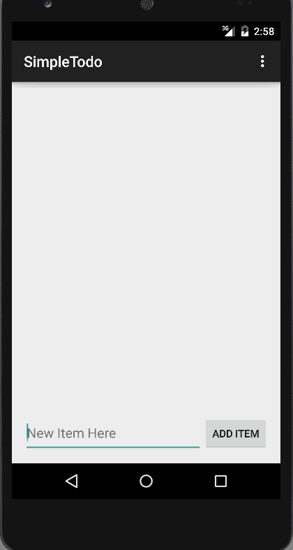

# SimpleTodo
CodePath Android Prework - Todo App

Time Spent: 3 hours from setup to publish on github

Functionalities:
- Successfully add and remove items from the todo list within your app
- Support for editing todo items
- Persist todo items and retrieve them properly on app restart

Walkthrough of all basic functionalities
